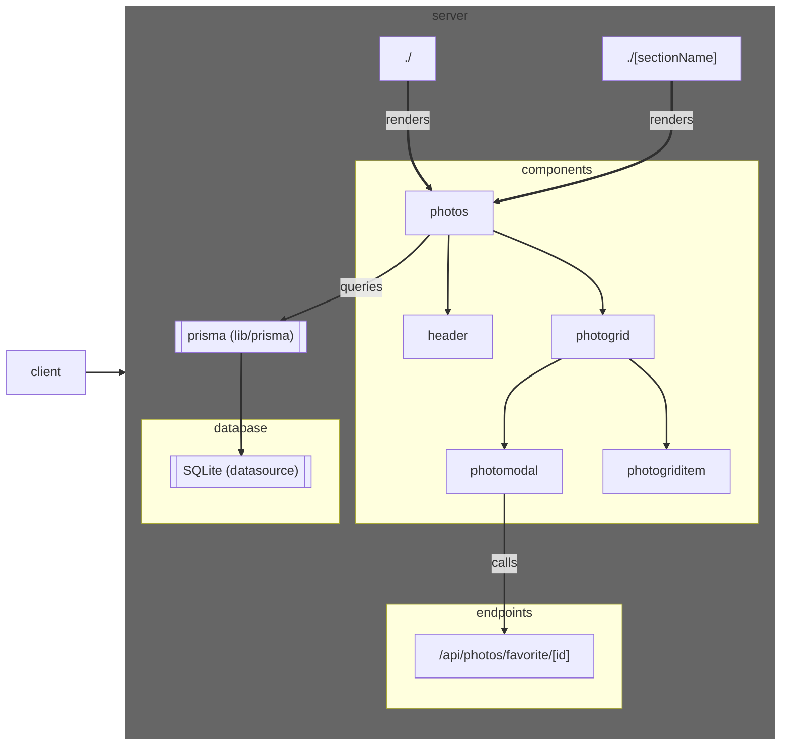

# Architecture Overview

**Architecture Diagram**

```mermaid
flowchart LR
  Client["client"]

  subgraph Server["server"]
    direction TB
    PagesRoot["./"]
    PagesSection["./[sectionName]"]
    PrismaClient[["prisma (lib/prisma)"]]


  subgraph Components["components"]
    direction TB
    Photos["photos"]
    Header["header"]
    PhotoGrid["photogrid"]
    PhotoGridItem["photogriditem"]
    PhotoModal["photomodal"]
  end

  subgraph Endpoints["endpoints"]
    FavoriteAPI["/api/photos/favorite/[id]"]
  end
    subgraph Data["database"]
    DB[["SQLite (datasource)"]]
  end
end

  %% client -> server
  Client --> Server

  %% Pages render the photos component
  PagesRoot -->|renders| Photos
  PagesSection -->|renders| Photos

  %% Photos composition
  Photos --> Header
  Photos --> PhotoGrid

  %% Components -> endpoint (favorite)
  PhotoModal -->|calls| FavoriteAPI

  %% Photos queries prisma on the server
  Photos -->|queries| PrismaClient


  PrismaClient --> DB

  %% PhotoGrid children
  PhotoGrid --> PhotoGridItem
  PhotoGrid --> PhotoModal
  %% make all links black, and make the "renders" links thicker
  linkStyle 0 stroke:#5b5c61,stroke-width:2px;
  linkStyle 1 stroke:#5b5c61,stroke-width:3px;
  linkStyle 2 stroke:#5b5c61,stroke-width:3px;
  linkStyle 3 stroke:#5b5c61,stroke-width:2px;
  linkStyle 4 stroke:#5b5c61,stroke-width:2px;
  linkStyle 5 stroke:#5b5c61,stroke-width:2px;
  linkStyle 6 stroke:#5b5c61,stroke-width:2px;
  linkStyle 7 stroke:#5b5c61,stroke-width:2px;
  linkStyle 8 stroke:#5b5c61,stroke-width:2px;
  linkStyle 9 stroke:#5b5c61,stroke-width:2px;
  linkStyle 0 stroke:#303030,stroke-width:2px;
  linkStyle 1 stroke:#303030,stroke-width:3px;
  linkStyle 2 stroke:#303030,stroke-width:3px;
  linkStyle 3 stroke:#303030,stroke-width:2px;
  linkStyle 4 stroke:#303030,stroke-width:2px;
  linkStyle 5 stroke:#303030,stroke-width:2px;
  linkStyle 6 stroke:#303030,stroke-width:2px;
  linkStyle 7 stroke:#303030,stroke-width:2px;
  linkStyle 8 stroke:#303030,stroke-width:2px;
  linkStyle 9 stroke:#303030,stroke-width:2px;

  classDef serverStyle fill:#666666,stroke:#666666,stroke-width:2px,stroke-dasharray:0;
  class Server serverStyle;
```

Notes
- **Database** stores section metadata and photo metadata (section membership, taken date, and the `isFavorite` flag).